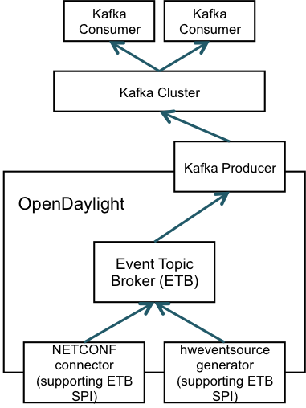
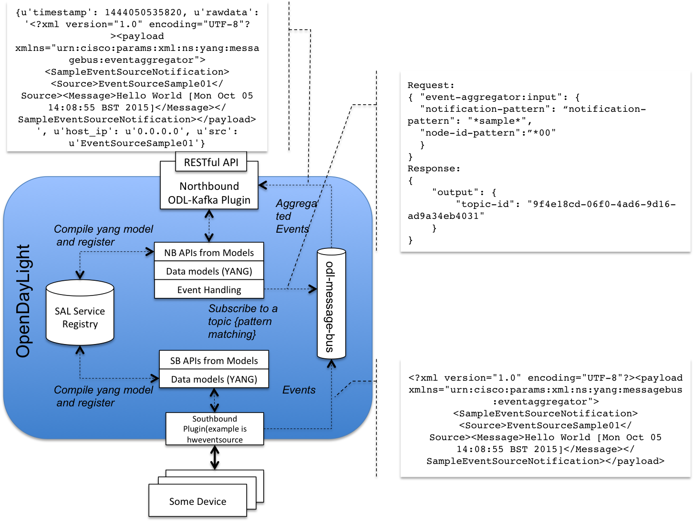

# Integrating OpenDayLight

* [Overview](#overview)
* [Prerequisites](#prerequisites)
* [Installation](#installation)
* [Configurations](#configurations)
* [Integration tests](#integration-tests)
* [Send data to PaNDA](#send-data-to-panda)

# Overview #
Integrating OpenDayLight (ODL) to PaNDA can be done via prod-odl-kafka, an ODL northbound plugin that streaming Event-Topic Broker (ETB) events to PaNDA cluster. The high-level architecture of `prod-odl-kafka` is shown as the diagram below.



The `prod-odl-kafka` has been development using Lithium maven artetype and tested against ODL Lithium 0.3.* releases (i.e. Lithium SR1, SR2, SR3, and SR4). 

# Prerequisites #
 * Java version 8
 * Maven version 3.3.*

# Installation #

### Step 1: Clone source code
```
$git clone https://cto-github.cisco.com/CTAO-Team6-Analytics/prod-odl-kafka.git
```

### Step 2: Build from source

In order to make the "build" process work, you will need OpenDaylight dependencies, which are organised as multiple inter-dependent projects within OpenDaylight repositories outside of Maven Central. This is achieved by placing the OpenDaylight `settings.xml` file into your local maven repository (see https://wiki.opendaylight.org/view/GettingStarted:Development_Environment_Setup for more details).

```
# Shortcut command for grabbing settings.xml
cp -n ~/.m2/settings.xml{,.orig} ; \
wget -q -O - https://raw.githubusercontent.com/opendaylight/odlparent/master/settings.xml > ~/.m2/settings.xml
```

If this plugin is supposed to be deployed on a pre-existed ODL container (see step 4), you will also need to replace the '<version>' value with the release version of your target ODL container. [NOTE: at the moment only Lithium releases have been tested and supported] 

This can be done by editing the `<parent>` section of the `prod-odl-kafka/kafka-agent/impl/pom.xml` file. Below is an example that builds for `Lithium-SR3` release. 

```
<parent>
    <groupId>org.opendaylight.controller</groupId>
    <artifactId>config-parent</artifactId>
    <version>0.3.3-Lithium-SR3</version>
    <relativePath/>
  </parent>
```

Now go to `kafka-agent` directory and build.

```
$cd kafka-agent 
kafka-agent$mvn clean install -Dcheckstyle.skip=true -DskipTests=true
```

###Step 3: Start Karaf container

Start karaf container by running the following command.

```
$./karaf/target/assembly/bin/karaf 
```

Once it starts successfully, you should be able to check all the features are deployed automatically. 

```
   ________                       ________                .__  .__       .__     __       
    \_____  \ ______   ____   ____ \______ \ _____  ___.__.|  | |__| ____ |  |___/  |_     
     /   |   \\____ \_/ __ \ /    \ |    |  \\__  \<   |  ||  | |  |/ ___\|  |  \   __\    
    /    |    \  |_> >  ___/|   |  \|    `   \/ __ \\___  ||  |_|  / /_/  >   Y  \  |      
    \_______  /   __/ \___  >___|  /_______  (____  / ____||____/__\___  /|___|  /__|      
            \/|__|        \/     \/        \/     \/\/            /_____/      \/          
                                                                                           

Hit '<tab>' for a list of available commands
and '[cmd] --help' for help on a specific command.
Hit '<ctrl-d>' or type 'system:shutdown' or 'logout' to shutdown OpenDaylight.

opendaylight-user@root>feature:list | grep 'kafka'
odl-kafka-agent-api               | 2.0.1-Lithium     | x         | odl-kafka-agent-2.0.1-Lithium            | OpenDaylight :: kafka-agent :: api                
odl-kafka-agent                   | 2.0.1-Lithium     | x         | odl-kafka-agent-2.0.1-Lithium            | OpenDaylight :: kafka-agent                       
odl-kafka-agent-rest              | 2.0.1-Lithium     | x         | odl-kafka-agent-2.0.1-Lithium            | OpenDaylight :: kafka-agent :: REST               
odl-kafka-agent-ui                | 2.0.1-Lithium     | x         | odl-kafka-agent-2.0.1-Lithium            | OpenDaylight :: kafka-agent :: UI                 
opendaylight-user@root>
```

### Deploy to pre-existed ODL container (optional)

If you have an existed ODL container, simply copy the `.kar` file to the `deploy` directory. See example below.

```
$sudo cp kafka-agent/features/target/kafka-agent-features-1.0.0-Lithium.kar /opt/distribution-karaf-0.3.3-Lithium-SR3/deploy/
```

`prod-odl-kafka` plugin should then be automatically deployed to the ODL container. To verify the success of the deployment, run `feature:list | grep 'kafka' ` command from ODL console, and you should see outputs as below.

```
opendaylight-user@root>feature:list | grep 'kafka'
odl-kafka-agent-api               | 2.0.1-Lithium     | x         | odl-kafka-agent-2.0.1-Lithium            | OpenDaylight :: kafka-agent :: api                
odl-kafka-agent                   | 2.0.1-Lithium     | x         | odl-kafka-agent-2.0.1-Lithium            | OpenDaylight :: kafka-agent                       
odl-kafka-agent-rest              | 2.0.1-Lithium     | x         | odl-kafka-agent-2.0.1-Lithium            | OpenDaylight :: kafka-agent :: REST               
odl-kafka-agent-ui                | 2.0.1-Lithium     | x         | odl-kafka-agent-2.0.1-Lithium            | OpenDaylight :: kafka-agent :: UI                 
opendaylight-user@root>
```

# Configurations #

Kafka plugin needs to be configured before starting consuming ETB messages. The list of configuration parameters are given below.


| parameter     | description                   | data type |         examples      | default | mandatory |
|:--------------|:------------------------------|:----------|:----------------------|:--------|:----------|
| kafka-broker-list| The Kafka bootstrapping broker list | string |-|Yes|
|compression-type |Compression codec for all messages|enum|none/gzip/snappy|none|Yes|
|kafka-topic|kafka topic name|string|"snmp"|-|Yes|
|message-serialization |Kafka message serialisation type|enum|	raw/avro|raw|Yes|
|avro-schema-namespace|avro schema namespace|string|com.example.project|%s|Yes|
|event-subscriptions |List of ODL topic subscriptions (if not set, kafka plugin listens to all ETB topics)|string|"[topic-id-1],[topic-id-2]"|-|No|
|default-host-ip |Default host ip address of event source (if not set, default value is set as 0.0.0.0)|string|127.0.0.1|	|0.0.0.0|No|
|default-message-source|Default event source name |string|bpg-ls|<node-id> value|No|
|timestamp-xpath|Xpath statement used to extract timestamp from ODL message payload (if not set, the ODL system time is used by default)|string|//timestamp|ODL system timestamp|No|
|message-host-ip-xpath|XPath statement used to extract host-ip value from ODL message payload (if not set, default-host-ip value is used).|string|//hostIP|default-host-ip value if not set|No|
|message-source-xpath| XPath statement used to extract message source value|	string	|//src|	default-message-source value if set	|No |

# Integration tests #

In order to demonstrate how `prod-odl-kafka` works, the [HWEventSource project](https://github.com/opendaylight/coretutorials/tree/master/hweventsource) was used. Make sure you use a Lithium release that matches target ODL container. For example use [this release](https://github.com/opendaylight/coretutorials/releases/tag/release%2Flithium-sr3) in consistence with the maven snippet in step 2. 

The following diagram shows the details of the integration tests.



### build `hweventsource` project

```
$cd coretutorials/hweventsource/
hweventsource$mvn clean install -Dcheckstyle.skip=true -DskipTests=true
```

### deploy `hweventsource` southbound event source

The deployment of `hweventsource` is as simple as copy the .kar file to a target ODL container, either the one comes with `prod-odl-agent` or a standalone distribution container. For example:

```
$cp hweventsource/features/target/hweventsource-features-1.0-Lithium.kar /opt/distribution-karaf-0.3.3-Lithium-SR3/deploy/
```

**NOTE:** make sure you start ODL container as a sudoer user, as hwevent source requires create /var/tmp/test-logs folder or create a fold with appropriate write permissions.

Once deployed successfully, you should be able to verify the deployment of `hweventsource` modules by running the command from ODL console as follows:

```
opendaylight-user@root>feature:list | grep 'hwevent'
odl-hweventsource-api             | 1.0.3-Lithium-SR3 | x         | odl-hweventsource-1.0.3-Lithium-SR3      | OpenDaylight :: hweventsource :: api              
odl-hweventsource                 | 1.0.3-Lithium-SR3 | x         | odl-hweventsource-1.0.3-Lithium-SR3      | OpenDaylight :: hweventsource                     
odl-hweventsource-rest            | 1.0.3-Lithium-SR3 | x         | odl-hweventsource-1.0.3-Lithium-SR3      | OpenDaylight :: hweventsource :: REST             
odl-hweventsource-ui              | 1.0.3-Lithium-SR3 | x         | odl-hweventsource-1.0.3-Lithium-SR3      | OpenDaylight :: hweventsource :: UI               
odl-hweventsource-uagent          | 1.0.3-Lithium-SR3 | x         | odl-hweventsource-1.0.3-Lithium-SR3      | OpenDaylight :: hweventsource :: UserAgent                
```

### Start local kafka cluster

```
$cd $KAFKA_HOME
$bin/zookeeper-server-start.sh config/zookeeper.properties
$bin/kafka-server-start.sh config/server.properties
```
Create a 'odl-test' topic
```
$bin/kafka-topics.sh --create --zookeeper localhost:2181 --replication-factor 1 --partitions 1 --topic odl-test
```
Start a consumer and listens to the topic
```
$bin/kafka-console-consumer.sh --zookeeper localhost:2181 --topic odl-test --from-beginning
```

### Congifure `prod-odl-kafka` plugin

`prod-odl-kafka` is configured using RESTCONF api.

```
$ curl --user admin:admin \ 
       --request PUT http://localhost:8080/restconf/config/kafka-agent:kafka-producer-config \
       --data '{kafka-producer-config: {kafka-broker-list: "127.0.0.1:9092", kafka-topic: "odl-test", compression-type: "none", message-serialization: "raw", avro-schema-namespace:"com.example.project"}}' \
       --header "Content-Type:application/yang.data+json"
```
To verify configurations are set properly, run:

```
$ curl --user admin:admin --request GET http://localhost:8080/restconf/config/kafka-agent:kafka-producer-config --header "Content-Type:application/yang.data+json"
```
You should see the output as:

```
{"kafka-producer-config":{"message-serialization":"raw","kafka-broker-list":"127.0.0.1:9092","avro-schema-namespace":"com.example.project","compression-type":"none","kafka-topic":"odl-test"}}
```

### Start "hello world" event source to generate some messages.

Run the following curl command to trigger the sample event source. 

```
$curl --user admin:admin --request POST http://localhost:8181/restconf/operations/event-aggregator:create-topic --header "Content-Type:application/json" --data '{ "event-aggregator:input": {"notification-pattern": "**", "node-id-pattern":"*"}}'
```

If successful, you should be able to see a topic-id is generated, for exmaple:

```
{"output":{"topic-id":"d48ac918-d8d3-4425-8945-0c7d98aa29a0"}}
```

Meanwhile keep an eye on the Kafka consumer console, you should see messages streamed from both sources (SampleEventSource01 and SampleEventSource00) continuously. 

```
...
<?xml version="1.0" encoding="UTF-8"?><payload xmlns="urn:cisco:params:xml:ns:yang:messagebus:eventaggregator"><SampleEventSourceNotification><Source>EventSourceSample01</Source><Message>Hello World [Mon Sep 28 14:37:55 BST 2015]</Message></SampleEventSourceNotification></payload>
<?xml version="1.0" encoding="UTF-8"?><payload xmlns="urn:cisco:params:xml:ns:yang:messagebus:eventaggregator"><SampleEventSourceNotification><Source>EventSourceSample00</Source><Message>Hello World [Mon Sep 28 14:37:58 BST 2015]</Message></SampleEventSourceNotification></payload>
<?xml version="1.0" encoding="UTF-8"?><payload xmlns="urn:cisco:params:xml:ns:yang:messagebus:eventaggregator"><SampleEventSourceNotification><Source>EventSourceSample01</Source><Message>Hello World [Mon Sep 28 14:37:58 BST 2015]</Message></SampleEventSourceNotification></payload>
...
```

# Send data to PaNDA #

Sending data to a launch PaNDA cluster is similar to [Integration tests](#integration-tests), except that you will need to [change `prod-odl-kafka` configurations](#congifure-prod-odl-kafka-plugin) linking to kafka endpoints of a target PaNDA cluster. 
